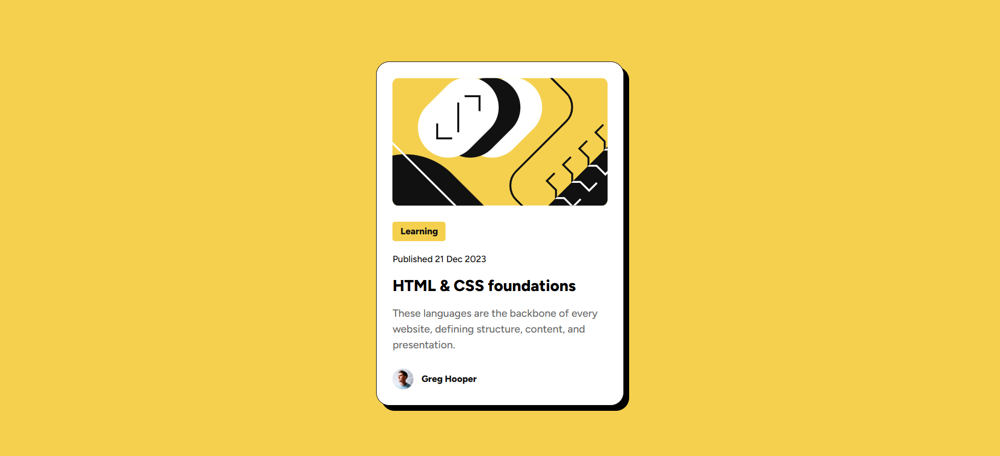

# 🟡 Tarjeta de vista previa al blog

Esta es una solución al [desafío de tarjeta de vista previa al blog en Frontend Mentor](https://www.frontendmentor.io/challenges/blog-preview-card-ckPaj01IcS). Los desafíos de Frontend Mentor te ayudan a mejorar tus habilidades de programación creando proyectos realistas.

## 🟡 Descripción general

### 📷 Captura de pantalla

### 🔗 Links
- [URL de la solución](https://www.frontendmentor.io/solutions/pgina-de-tarjeta-de-vista-previa-al-blog-con-html-y-css-trMPSYSVMz)
- [URL del sitio en vivo](https://braismarquez2025.github.io/blog-preview-card-main/)

### 🔧 Llevado a cabo con

- HTML
- SCSS

### ✌️ Autor 
- 💼 GitHub - https://github.com/braismarquez2025
- ✉️ Gmail - braismarquez2003@gmail.com
- 👤 Usuario de Frontend - [@braismarquez2025](https://www.frontendmentor.io/profile/braismarquez2025)
